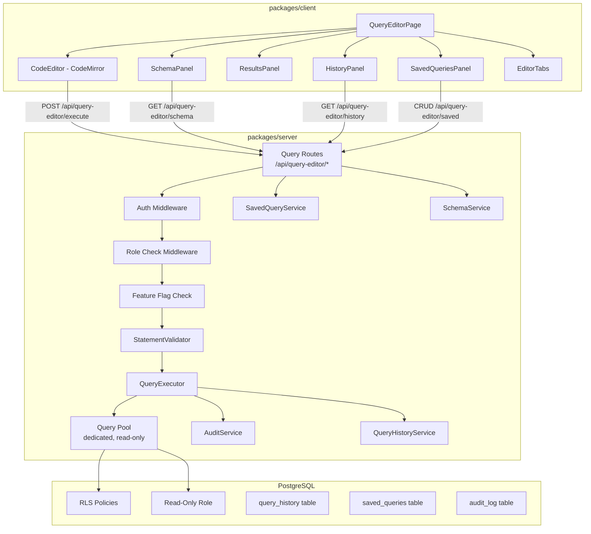

# Design Document: Query Editor

## Overview

The Query Editor is a browser-based SQL query module for the DayStream platform that enables authorized users (system_admin, tenant_owner) to execute read-only SQL queries against the PostgreSQL database within their tenant scope. The system enforces defense-in-depth security through statement validation, RLS enforcement, a dedicated read-only database role, and resource limits (timeouts, row caps, concurrency).

The architecture follows DayStream's existing patterns: Express routes with JWT auth middleware on the backend, React components with the design system on the frontend, and PostgreSQL with RLS for data isolation.

## Architecture



### Key Architectural Decisions

1. **Separate connection pool**: The Query Editor uses a dedicated PostgreSQL connection pool (`queryPool`) with a read-only role, separate from the main application pool. This prevents query workload from affecting the application and enforces read-only at the database level.

2. **Defense-in-depth for read-only**: Three layers prevent writes: (a) Statement validation rejects non-SELECT, (b) The database role has only SELECT privileges, (c) RLS policies restrict row visibility.

3. **CodeMirror for the editor**: CodeMirror 6 is chosen over Monaco due to its smaller bundle size, better tree-shaking, and simpler integration with React. It supports SQL syntax highlighting, auto-completion, and keyboard shortcuts.

4. **Audit-first execution**: Query execution writes the audit log entry BEFORE returning results. If audit logging fails, the query result is not returned to the user (Requirement 11.7).

5. **Feature flag gating**: Query Editor access per tenant is controlled via the existing `feature-flag.service.ts` with a `query_editor_enabled` flag, allowing per-tenant rollout.

## Components and Interfaces

### Backend Components

#### StatementValidator (`packages/server/src/services/query-editor/statement-validator.ts`)

Validates SQL statements before execution. Performs static analysis to ensure only SELECT statements are allowed.

```typescript
interface ValidationResult {
  valid: boolean;
  error?: {
    code: string;
    message: string;
    violatedRule: string;
    rejectedPattern?: string;
  };
}

interface StatementValidatorConfig {
  maxQueryLength: number;             // default: 10000
  blockedFunctions: string[];         // configurable blocklist
}

function validateStatement(sql: string, config: StatementValidatorConfig): ValidationResult;
```

**Validation pipeline:**
1. Check length (≤ 10,000 chars)
2. Strip comments (single-line `--` and multi-line `/* */`)
3. Check for multiple statements (semicolons)
4. Normalize whitespace and case for keyword matching
5. Check top-level command is SELECT (reject SELECT INTO)
6. Check for blocked keywords (INSERT, UPDATE, DELETE, DROP, CREATE, ALTER, TRUNCATE, GRANT, REVOKE, COPY, BEGIN, COMMIT, ROLLBACK, SAVEPOINT)
7. Check for blocked function calls
8. Check for system catalog writes

#### QueryExecutor (`packages/server/src/services/query-editor/query-executor.ts`)

Executes validated queries within the tenant context with resource limits.

```typescript
interface QueryExecutionRequest {
  sql: string;
  tenantId: string;
  userId: string;
  timeoutMs?: number;       // default: 30000
  maxRows?: number;         // default: 10000
}

interface QueryExecutionResult {
  columns: ColumnMeta[];
  rows: Record<string, unknown>[];
  rowCount: number;
  truncated: boolean;
  totalRowCount?: number;
  executionTimeMs: number;
  status: 'success' | 'error' | 'timeout' | 'cancelled';
}

interface ColumnMeta {
  name: string;
  dataType: string;
}

class QueryExecutor {
  execute(request: QueryExecutionRequest): Promise<QueryExecutionResult>;
  cancel(userId: string): Promise<boolean>;
}
```

**Execution flow:**
1. Acquire connection from `queryPool` (reject if pool exhausted)
2. Check user concurrency (reject if user already has active query)
3. Set `statement_timeout` on connection
4. Set `app.current_tenant_id` and `app.current_user_id` via `SET LOCAL`
5. Execute query with `LIMIT maxRows + 1` wrapper to detect truncation
6. Record execution metrics
7. Release connection back to pool

#### QueryHistoryService (`packages/server/src/services/query-editor/query-history.service.ts`)

```typescript
interface QueryHistoryEntry {
  id: string;
  userId: string;
  tenantId: string;
  queryText: string;
  executionTimeMs: number;
  rowCount: number;
  status: 'success' | 'error' | 'timeout' | 'cancelled';
  createdAt: string;
}

class QueryHistoryService {
  record(entry: Omit<QueryHistoryEntry, 'id' | 'createdAt'>): Promise<void>;
  list(userId: string, tenantId: string, options: { search?: string; limit?: number }): Promise<QueryHistoryEntry[]>;
  purgeOlderThan(days: number): Promise<number>;
}
```

#### SavedQueryService (`packages/server/src/services/query-editor/saved-query.service.ts`)

```typescript
interface SavedQuery {
  id: string;
  userId: string;
  tenantId: string;
  name: string;
  description?: string;
  queryText: string;
  createdAt: string;
  updatedAt: string;
}

interface SaveQueryInput {
  name: string;           // 1-100 chars, unique per user
  description?: string;   // max 500 chars
  queryText: string;      // max 10000 chars
}

class SavedQueryService {
  create(userId: string, tenantId: string, input: SaveQueryInput): Promise<SavedQuery>;
  update(id: string, userId: string, input: Partial<SaveQueryInput>): Promise<SavedQuery>;
  delete(id: string, userId: string): Promise<void>;
  list(userId: string, tenantId: string, options: { search?: string }): Promise<SavedQuery[]>;
  getById(id: string, userId: string): Promise<SavedQuery | null>;
}
```

#### SchemaService (`packages/server/src/services/query-editor/schema.service.ts`)

```typescript
interface TableInfo {
  tableName: string;
  columns: ColumnInfo[];
}

interface ColumnInfo {
  columnName: string;
  dataType: string;
  isNullable: boolean;
}

class SchemaService {
  getTables(tenantId: string): Promise<TableInfo[]>;
}
```

Queries `information_schema.tables` and `information_schema.columns` filtered to public schema, excluding system/internal tables via a configurable exclusion list.

#### Query Routes (`packages/server/src/routes/query-editor.ts`)

| Method | Path | Description |
|--------|------|-------------|
| POST | `/api/query-editor/execute` | Execute a SQL query |
| POST | `/api/query-editor/cancel` | Cancel running query |
| GET | `/api/query-editor/schema` | Get schema information |
| GET | `/api/query-editor/history` | List query history |
| GET | `/api/query-editor/saved` | List saved queries |
| POST | `/api/query-editor/saved` | Save a query |
| PUT | `/api/query-editor/saved/:id` | Update a saved query |
| DELETE | `/api/query-editor/saved/:id` | Delete a saved query |

All routes use: `authenticate → roleCheck(['system_admin', 'tenant_owner']) → featureFlagCheck('query_editor_enabled')`

### Frontend Components

#### QueryEditorPage (`packages/client/src/pages/QueryEditorPage.tsx`)

Top-level page component that orchestrates the layout: editor tabs with CodeMirror instances, schema browser panel, results panel, and history/saved queries panel.

#### CodeEditor (`packages/client/src/components/query-editor/CodeEditor.tsx`)

Wraps CodeMirror 6 with SQL language mode, auto-completion provider, and keyboard shortcuts.

#### EditorTabs (`packages/client/src/components/query-editor/EditorTabs.tsx`)

Manages up to 10 independent editor tabs with their own content and state. Persists to sessionStorage.

#### SchemaPanel (`packages/client/src/components/query-editor/SchemaPanel.tsx`)

Tree-view of tables and columns with search/filter. Click-to-insert into editor.

#### ResultsPanel (`packages/client/src/components/query-editor/ResultsPanel.tsx`)

Tabular results with sortable columns, fixed headers, horizontal scroll, and cell truncation. Handles null display, empty states, error display, and truncation notices.

#### HistoryPanel (`packages/client/src/components/query-editor/HistoryPanel.tsx`)

Displays recent queries with search. Click to load into editor.

#### SavedQueriesPanel (`packages/client/src/components/query-editor/SavedQueriesPanel.tsx`)

CRUD interface for named saved queries with search.

#### ExportControls (`packages/client/src/components/query-editor/ExportControls.tsx`)

CSV and JSON export buttons. Generates files client-side from the current result set.

## Data Models

### Database Tables

#### `query_history`

```sql
CREATE TABLE query_history (
  id UUID PRIMARY KEY DEFAULT gen_random_uuid(),
  tenant_id UUID NOT NULL REFERENCES tenants(id),
  user_id UUID NOT NULL REFERENCES users(id),
  query_text TEXT NOT NULL CHECK(char_length(query_text) <= 10000),
  execution_time_ms INTEGER NOT NULL,
  row_count INTEGER NOT NULL DEFAULT 0,
  status VARCHAR(20) NOT NULL CHECK(status IN ('success', 'error', 'timeout', 'cancelled')),
  error_message TEXT,
  truncated BOOLEAN NOT NULL DEFAULT FALSE,
  created_at TIMESTAMPTZ NOT NULL DEFAULT NOW()
);

-- RLS policy
ALTER TABLE query_history ENABLE ROW LEVEL SECURITY;
CREATE POLICY query_history_tenant_isolation ON query_history
  USING (tenant_id = current_setting('app.current_tenant_id')::uuid);
CREATE POLICY query_history_user_scope ON query_history
  USING (user_id = current_setting('app.current_user_id')::uuid);

-- Index for user history lookups
CREATE INDEX idx_query_history_user_created ON query_history(user_id, created_at DESC);
-- Index for auto-purge
CREATE INDEX idx_query_history_created_at ON query_history(created_at);
```

#### `saved_queries`

```sql
CREATE TABLE saved_queries (
  id UUID PRIMARY KEY DEFAULT gen_random_uuid(),
  tenant_id UUID NOT NULL REFERENCES tenants(id),
  user_id UUID NOT NULL REFERENCES users(id),
  name VARCHAR(100) NOT NULL,
  description VARCHAR(500),
  query_text TEXT NOT NULL CHECK(char_length(query_text) <= 10000),
  created_at TIMESTAMPTZ NOT NULL DEFAULT NOW(),
  updated_at TIMESTAMPTZ NOT NULL DEFAULT NOW(),
  UNIQUE(user_id, name)
);

-- RLS policy
ALTER TABLE saved_queries ENABLE ROW LEVEL SECURITY;
CREATE POLICY saved_queries_tenant_isolation ON saved_queries
  USING (tenant_id = current_setting('app.current_tenant_id')::uuid);
CREATE POLICY saved_queries_user_scope ON saved_queries
  USING (user_id = current_setting('app.current_user_id')::uuid);

-- Index for user lookups
CREATE INDEX idx_saved_queries_user ON saved_queries(user_id, updated_at DESC);
```

#### Dedicated Read-Only Role

```sql
CREATE ROLE daystream_query_reader WITH LOGIN PASSWORD '...';
GRANT CONNECT ON DATABASE daystream TO daystream_query_reader;
GRANT USAGE ON SCHEMA public TO daystream_query_reader;
GRANT SELECT ON ALL TABLES IN SCHEMA public TO daystream_query_reader;
ALTER DEFAULT PRIVILEGES IN SCHEMA public GRANT SELECT ON TABLES TO daystream_query_reader;
```

### TypeScript Interfaces (Shared)

```typescript
// packages/shared/src/types/query-editor.ts

export interface QueryExecuteRequest {
  sql: string;
  tenantId?: string;  // Required for system_admin if not in JWT
}

export interface QueryExecuteResponse {
  columns: { name: string; dataType: string }[];
  rows: Record<string, unknown>[];
  rowCount: number;
  truncated: boolean;
  totalRowCount?: number;
  executionTimeMs: number;
  status: 'success' | 'error' | 'timeout' | 'cancelled';
  error?: string;
}

export interface SchemaTable {
  tableName: string;
  columns: {
    columnName: string;
    dataType: string;
    isNullable: boolean;
  }[];
}

export interface SavedQueryDTO {
  id: string;
  name: string;
  description?: string;
  queryText: string;
  createdAt: string;
  updatedAt: string;
}

export interface QueryHistoryDTO {
  id: string;
  queryText: string;
  executionTimeMs: number;
  rowCount: number;
  status: 'success' | 'error' | 'timeout' | 'cancelled';
  createdAt: string;
}
```


## Correctness Properties

*A property is a characteristic or behavior that should hold true across all valid executions of a system — essentially, a formal statement about what the system should do. Properties serve as the bridge between human-readable specifications and machine-verifiable correctness guarantees.*

### Property 1: Role-based access control

*For any* user with a role that is NOT system_admin or tenant_owner, the query editor authorization check SHALL deny access (return false/403), and *for any* user with role system_admin or tenant_owner, it SHALL grant access.

**Validates: Requirements 1.1, 1.2**

### Property 2: SELECT-only validation

*For any* SQL string whose normalized top-level command is SELECT (excluding SELECT INTO), the statement validator SHALL return valid=true. *For any* SQL string whose top-level command is INSERT, UPDATE, DELETE, DROP, CREATE, ALTER, TRUNCATE, GRANT, REVOKE, COPY, BEGIN, COMMIT, ROLLBACK, or SAVEPOINT, the validator SHALL return valid=false.

**Validates: Requirements 2.1, 2.2, 2.3, 2.8**

### Property 3: Blocked function rejection

*For any* SELECT statement that contains a call to a function on the configured blocklist (e.g., pg_terminate_backend, set_config, lo_import, lo_export, pg_read_file, pg_write_file, dblink_exec), the statement validator SHALL return valid=false with an error identifying the blocked function.

**Validates: Requirements 2.5**

### Property 4: Multi-statement rejection

*For any* input containing two or more SQL statements separated by semicolons, the statement validator SHALL return valid=false regardless of whether the individual statements would be valid.

**Validates: Requirements 2.6**

### Property 5: Obfuscation resistance

*For any* SQL statement that would be rejected by the validator, wrapping blocked keywords in SQL comments (single-line `--` or multi-line `/* */`) or varying the case of keywords SHALL NOT prevent rejection. The validator produces the same verdict regardless of comment insertion or case variation.

**Validates: Requirements 2.10, 2.11**

### Property 6: Query length validation

*For any* input string exceeding 10,000 characters in length, the statement validator SHALL return valid=false with an error identifying the length violation.

**Validates: Requirements 2.12, 4.7**

### Property 7: Validation error identification

*For any* SQL statement that fails validation, the returned error SHALL contain a non-empty `violatedRule` field that identifies which specific validation rule was violated (e.g., "BLOCKED_COMMAND", "BLOCKED_FUNCTION", "MULTI_STATEMENT", "LENGTH_EXCEEDED").

**Validates: Requirements 2.7**

### Property 8: RLS tenant isolation

*For any* query executed through the Query Executor with a given tenant context, all rows in the result set SHALL belong exclusively to that tenant. No row from a different tenant SHALL appear in the results.

**Validates: Requirements 3.5**

### Property 9: Timeout enforcement

*For any* query whose execution duration exceeds the configured Query_Timeout, the Query Executor SHALL terminate the query and return a result with status='timeout' and an executionTimeMs value that is approximately equal to (within tolerance of) the configured timeout.

**Validates: Requirements 4.1, 4.5**

### Property 10: Row limit enforcement

*For any* query that would return more than the configured maximum row count, the Query Executor SHALL return exactly maxRows rows with truncated=true in the response metadata.

**Validates: Requirements 4.2, 4.6**

### Property 11: Case-insensitive substring filtering

*For any* list of items (tables, history entries, or saved queries) and *for any* search string, the filter function SHALL return exactly those items whose searchable field contains the search string as a case-insensitive substring. Items not containing the substring SHALL be excluded, and all items containing it SHALL be included.

**Validates: Requirements 6.3, 8.5, 9.8**

### Property 12: Cursor-position insertion

*For any* editor content string, *for any* valid cursor position within that string, and *for any* identifier to insert, the insertion function SHALL produce a new string where the identifier appears at exactly the specified cursor position with the rest of the content unchanged.

**Validates: Requirements 6.4, 6.5**

### Property 13: Client-side column sort

*For any* result set with at least 2 rows and *for any* column, sorting by that column in ascending order SHALL produce rows where each value is ≤ the next value (using appropriate type comparison). Sorting in descending order SHALL produce the reverse.

**Validates: Requirements 7.3**

### Property 14: Cell content truncation

*For any* cell value whose string representation exceeds 256 characters, the display function SHALL render only the first 256 characters followed by a truncation indicator. *For any* cell value with 256 or fewer characters, the full content SHALL be rendered without truncation.

**Validates: Requirements 7.10**

### Property 15: User data isolation

*For any* user querying their query history or saved queries, the returned list SHALL contain only entries belonging to that user. No entries from other users (even within the same tenant) SHALL appear.

**Validates: Requirements 8.2, 8.7, 9.2**

### Property 16: History storage truncation

*For any* query text exceeding 10,000 characters, the stored history entry SHALL contain only the first 10,000 characters and a truncation indicator.

**Validates: Requirements 8.9**

### Property 17: Saved query input validation

*For any* name string that is between 1 and 100 characters (inclusive) and is not composed entirely of whitespace, and *for any* description ≤ 500 characters (or absent), and *for any* query text ≤ 10,000 characters, the save operation SHALL accept the input (assuming name uniqueness is satisfied). *For any* name that is empty, exceeds 100 characters, or is whitespace-only, the operation SHALL reject.

**Validates: Requirements 9.1, 9.5, 9.9**

### Property 18: Saved query count limit

*For any* user who already has exactly the configured maximum number of saved queries (default 50), attempting to create a new saved query SHALL be rejected with an appropriate error.

**Validates: Requirements 9.7**

### Property 19: CSV export correctness

*For any* result set, the CSV export function SHALL produce output conforming to RFC 4180: column headers as the first row, comma-delimited fields, double-quote enclosure for fields containing commas/quotes/newlines, null values as empty fields, and UTF-8 encoding. Parsing the output back into a data structure SHALL reproduce the original column names and cell values (round-trip for non-null values).

**Validates: Requirements 10.1, 10.3, 10.9**

### Property 20: JSON export correctness

*For any* result set, the JSON export function SHALL produce a valid JSON array of objects where each object has keys matching column names and values matching cell data (with null represented as JSON null). Parsing the JSON output SHALL reproduce the original result set structure.

**Validates: Requirements 10.2, 10.9**

### Property 21: Audit entry completeness

*For any* query editor action (execution, validation rejection, or access attempt), the created audit log entry SHALL contain all required fields: user_id, tenant_id, action type, timestamp, and action-specific metadata (query text, duration, row count, status for executions; rejection reason for validations).

**Validates: Requirements 1.4, 11.1, 11.2**

### Property 22: Audit privacy — no result data

*For any* audit log entry created by the query editor, the entry SHALL NOT contain any actual row data from the result set. Only metadata (row count, column count, execution time) SHALL be present.

**Validates: Requirements 11.4**

## Error Handling

| Error Scenario | HTTP Status | Error Code | User-Facing Message |
|---|---|---|---|
| No/invalid/expired JWT | 401 | AUTH_REQUIRED | Authentication required |
| Insufficient role | 403 | FORBIDDEN | Insufficient permissions to access Query Editor |
| Feature disabled for tenant | 403 | FEATURE_DISABLED | Query Editor is not enabled for your organization |
| Statement validation failure | 400 | VALIDATION_FAILED | Query rejected: {violatedRule description} |
| Query length exceeded | 400 | QUERY_TOO_LONG | Query exceeds maximum length of 10,000 characters |
| Missing tenant context (admin) | 400 | MISSING_CONTEXT | A tenant context must be selected before executing queries |
| Context setup failure | 500 | CONTEXT_FAILED | Unable to establish database context. Please try again. |
| Query timeout | 408 | QUERY_TIMEOUT | Query exceeded the {N}s time limit and was terminated |
| Row limit reached | 200 (partial) | — | Results truncated: showing first {N} of {total} rows |
| User concurrency limit | 429 | CONCURRENT_LIMIT | You already have a query running. Wait for it to complete or cancel it. |
| Pool exhausted | 503 | CAPACITY_REACHED | System is at capacity. Please retry in a moment. |
| Audit write failure | 500 | AUDIT_FAILED | Unable to process query at this time. Please try again. |
| Saved query name conflict | 409 | DUPLICATE_NAME | A saved query with this name already exists |
| Saved query limit reached | 400 | SAVE_LIMIT | Maximum saved query limit (50) reached |
| Schema load failure | 500 | SCHEMA_ERROR | Unable to load schema information |
| History load failure | 500 | HISTORY_ERROR | Query history is temporarily unavailable |

### Error Handling Principles

1. **Never expose internal details**: PostgreSQL error messages are sanitized before returning to the client — remove file paths, internal function names, or stack traces. Return the PG error message text only.
2. **Audit failures block execution**: If audit logging fails, the query is not executed (fail-closed for security).
3. **Timeout cleanup**: When a query is terminated due to timeout, the connection is rolled back and returned to the pool in a clean state.
4. **Graceful degradation**: Schema browser and history panel failures do not block query execution — they show error states independently.

## Testing Strategy

### Property-Based Testing

Property-based tests are the primary verification method for the statement validator, export functions, and filtering/sorting logic. These are pure functions with large input spaces where input variation reveals edge cases.

**Library**: `fast-check` (already compatible with Vitest in both packages)

**Configuration**: Minimum 100 iterations per property test.

**Tag format**: `Feature: 24-query-editor, Property {number}: {property_text}`

**Target properties for PBT:**
- Properties 2-7 (Statement Validator) — pure function, huge input space
- Property 11 (Substring filtering) — pure function
- Property 12 (Cursor insertion) — pure function
- Property 13 (Column sort) — pure function
- Property 14 (Cell truncation) — pure function
- Property 17 (Input validation) — pure function
- Properties 19-20 (CSV/JSON export) — serialization round-trip

### Unit Tests (Example-Based)

Unit tests with specific examples cover:
- Role authorization edge cases (specific role strings)
- Feature flag integration
- History and saved query CRUD operations
- UI component states (loading, error, empty)
- Keyboard shortcut bindings
- Tab management edge cases (max tabs, close last tab)
- Export file naming format
- Query cancellation flow

### Integration Tests

Integration tests verify:
- RLS enforcement with real database (Property 8)
- Tenant context setting on connections
- Timeout enforcement with `pg_sleep`
- Connection pool behavior under load
- Audit log HMAC chain integrity
- Schema browser with real information_schema queries
- History purge cron behavior

### Test File Organization

```
packages/server/src/services/query-editor/__tests__/
  statement-validator.property.test.ts    (Properties 2-7)
  query-executor.integration.test.ts       (Properties 8-10)
  query-history.service.test.ts            (Properties 15-16)
  saved-query.service.test.ts              (Properties 17-18)
  audit-query.test.ts                      (Properties 21-22)

packages/client/src/components/query-editor/__tests__/
  filter.property.test.ts                  (Property 11)
  cursor-insertion.property.test.ts        (Property 12)
  column-sort.property.test.ts             (Property 13)
  cell-truncation.property.test.ts         (Property 14)
  csv-export.property.test.ts              (Property 19)
  json-export.property.test.ts             (Property 20)
  ResultsPanel.test.tsx                    (example-based UI tests)
  SchemaPanel.test.tsx                     (example-based UI tests)
  EditorTabs.test.tsx                      (example-based UI tests)
```
