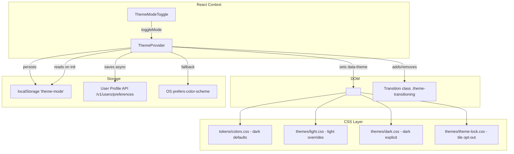
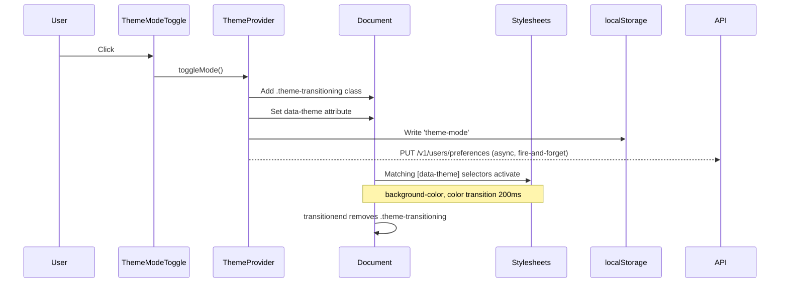

# Design Document: Dark/Light Mode Switch

## Overview

This feature enhances the existing theme infrastructure to provide a polished dark/light mode toggle for the DayStream application. The current codebase already has a `ThemeProvider` with mode detection and a basic `ThemeModeToggle` component — this design refines both, rewrites the light mode palette to a premium warm ivory aesthetic, and ensures dashboard tiles opt out of theming.

### Key Design Decisions

1. **Enhance existing infrastructure** rather than rewrite. The `ThemeProvider` already manages `data-theme`, localStorage, and OS preference detection. We augment it with transition orchestration and optional API persistence.
2. **CSS custom properties remain the single source of truth** for all theme-aware colors. Inline styles in `AppLayout` and `LanguageSwitcher` must be migrated to use CSS variables so they respond to theme changes.
3. **Dashboard tiles opt out via a dedicated CSS class** (`[data-theme-lock="dark"]`) that re-applies dark token values regardless of the active theme, rather than using `!important` overrides.
4. **KPI cards use conditional styling** via a `[data-theme='light'] .kpiCard` selector to apply the glass-morphism effect only in light mode.

## Architecture



### Transition Flow



## Components and Interfaces

### ThemeProvider (Enhanced)

```typescript
interface ThemeContextValue {
  mode: 'dark' | 'light';
  toggleMode: () => void;
  businessTheme: BusinessTheme | null;
}
```

**Changes from current implementation:**
- Add transition class management (`theme-transitioning`) on the `<html>` element during mode switch
- Keep the existing `detectSystemPreference()` logic (already correct)
- Add optional API persistence (fire-and-forget PUT to user preferences endpoint)
- Ensure `data-theme` attribute and localStorage write happen synchronously in the same effect

### ThemeModeToggle (Enhanced)

```typescript
interface ThemeModeToggleProps {
  className?: string;
}
```

**Changes from current implementation:**
- Replace emoji icons (☀️/🌙) with inline SVG icons for consistent rendering across platforms
- Add `transition` on the icon for smooth swap without layout shift
- Maintain existing `aria-label` and keyboard accessibility (already handled by `<button>`)
- Style the button using CSS variables instead of inline styles

### AppLayout (Refactored Styles)

**Changes:**
- Replace all hardcoded color values in the `styles` object with CSS custom property references (`var(--color-background)`, `var(--color-text)`, etc.)
- The `LanguageSwitcher` inline styles also need the same treatment
- Insert `<ThemeModeToggle />` between `<LanguageSwitcher />` and the user name `<span>` in the header right section

### Dashboard Tiles — Theme Lock

Components that must remain dark:
- `ModuleTile` — the navigation tiles on the dashboard
- Optionally any future dashboard widgets that need dark backgrounds

**Implementation approach:**
- Add a `data-theme-lock="dark"` attribute to tile wrapper elements
- Create `themes/theme-lock.css` that re-declares dark token values scoped under `[data-theme-lock="dark"]`
- This keeps the opt-out declarative and doesn't require JS logic

### KpiCard — Light Mode Glass Effect

- Add `[data-theme='light'] .card` selector in `KpiCard.module.css` to apply glass-morphism
- In light mode: `background: rgba(255,255,255,0.7); backdrop-filter: blur(12px); border: 1px solid rgba(229,221,205,0.6);`
- In dark mode: keep existing `var(--color-surface)` background

## Data Models

### localStorage Schema

| Key | Type | Values | Default |
|-----|------|--------|---------|
| `theme-mode` | string | `'dark'` \| `'light'` | (absent — triggers OS detection) |

### User Preferences API (Optional)

```
PUT /v1/users/preferences
Content-Type: application/json

{
  "theme_mode": "dark" | "light"
}
```

Response: `204 No Content` on success. Non-critical — failure is silently ignored.

### CSS Custom Properties Contract (Light Mode)

| Token | Light Mode Value | Purpose |
|-------|-----------------|---------|
| `--color-background` | `#F8F5EE` | Main page background (warm ivory) |
| `--color-background-gradient` | `radial-gradient(ellipse at top, #FDF9F0 0%, #F8F5EE 70%)` | Subtle golden gradient |
| `--color-surface` | `#FFFFFF` (via rgba with blur) | Card/surface background |
| `--color-surface-hover` | `#F5F0E6` | Surface hover state |
| `--color-surface-active` | `#EDE7D9` | Surface active/pressed state |
| `--color-text` | `#2C2C2C` | Primary text (charcoal) |
| `--color-text-secondary` | `#666666` | Secondary text |
| `--color-text-inverse` | `#F5F5F3` | Inverse text for dark surfaces |
| `--color-border` | `#E5DDCD` | Light border |
| `--color-border-hover` | `#D8CEBA` | Medium border |
| `--color-primary` | `#C89B3C` | Brand gold accent |
| `--color-primary-hover` | `#B88A2E` | Brand gold hover |
| `--color-primary-active` | `#A67B28` | Brand gold active |
| `--color-primary-contrast` | `#FFFFFF` | Text on primary |
| `--color-sidebar-bg` | `#F7F3EA` | Sidebar background |
| `--color-sidebar-border` | `#E5DDCD` | Sidebar border |
| `--color-header-bg` | `rgba(255,255,255,0.6)` | Header glass background |
| `--color-nav-active-bg` | `#F1E7D0` | Active menu item background |
| `--color-nav-active-text` | `#A77D22` | Active menu item text |
| `--shadow-sm` | `0 1px 3px rgba(0,0,0,0.04)` | Subtle shadow |
| `--shadow-md` | `0 4px 12px rgba(0,0,0,0.05)` | Medium shadow |
| `--shadow-lg` | `0 8px 24px rgba(0,0,0,0.08)` | Large shadow |


## Correctness Properties

*A property is a characteristic or behavior that should hold true across all valid executions of a system — essentially, a formal statement about what the system should do. Properties serve as the bridge between human-readable specifications and machine-verifiable correctness guarantees.*

### Property 1: Toggle produces opposite mode

*For any* current theme mode (dark or light), clicking the toggle button SHALL result in the mode switching to the opposite value. Equivalently, for any starting mode and any number N of toggle clicks, the resulting mode equals the starting mode if N is even, and the opposite mode if N is odd.

**Validates: Requirements 2.1, 2.2**

### Property 2: DOM attribute matches mode state

*For any* sequence of mode changes (via toggle, initialization, or OS detection), the `data-theme` attribute on `document.documentElement` SHALL always equal the current mode value held in the ThemeProvider state.

**Validates: Requirements 2.4**

### Property 3: localStorage persistence round-trip

*For any* valid theme mode value, writing it to localStorage under the key `theme-mode` and then initializing a new ThemeProvider instance SHALL result in the provider's initial mode equaling that stored value.

**Validates: Requirements 3.1, 3.2**

### Property 4: Dashboard tile background invariant

*For any* theme mode (dark or light), elements with `data-theme-lock="dark"` SHALL have their background color resolve to #222222, unaffected by the active theme's CSS custom property overrides.

**Validates: Requirements 6.1, 6.2, 6.3**

### Property 5: No pure white layout backgrounds in light mode

*For any* layout surface CSS custom property (`--color-background`, `--color-surface`, `--color-sidebar-bg`, `--color-header-bg`) while light mode is active, the resolved value SHALL NOT equal pure white (#FFFFFF).

**Validates: Requirements 8.1**

### Property 6: Accessible label reflects available action

*For any* current theme mode, the `aria-label` attribute of the ThemeModeToggle button SHALL contain the name of the opposite mode (i.e., when in dark mode the label mentions "light", and vice versa).

**Validates: Requirements 9.2**

## Error Handling

| Scenario | Handling Strategy |
|----------|------------------|
| localStorage is unavailable (private browsing, quota exceeded) | Catch the exception silently; default to OS preference. Theme works for the session but won't persist. |
| User profile API call fails (network error, 5xx) | Fire-and-forget — do not block or show errors. localStorage is the primary persistence. |
| OS preference media query not supported | Default to `'dark'` (the app's design-first theme). |
| Invalid value in localStorage (`theme-mode` is not 'dark' or 'light') | Ignore the stored value and fall through to OS detection. |
| `backdrop-filter` not supported (older browsers) | The glass effect degrades gracefully to a solid semi-transparent background via CSS fallback. |
| CSS custom property not supported (very old browsers) | Out of scope — the app requires modern browser support. |

## Testing Strategy

### Unit Tests (Example-Based)

Unit tests cover specific scenarios, edge cases, and static value checks:

- **Toggle icon mapping**: Dark mode → sun icon; light mode → moon icon (Req 1.3)
- **Header placement**: ThemeModeToggle renders between LanguageSwitcher and user name (Req 1.1)
- **Visibility when authenticated**: Toggle is visible when user is logged in (Req 1.2)
- **OS preference fallback**: When localStorage is empty, provider uses `prefers-color-scheme` (Req 3.3)
- **Light mode CSS values**: Verify each CSS custom property matches the specified hex values (Req 4.1–4.7, 5.1–5.2)
- **KPI card glass effect**: Light mode applies glass-morphism; dark mode uses standard surface (Req 7.1–7.3)
- **Keyboard accessibility**: Enter and Space trigger toggle (Req 9.3)
- **Tab focus**: Toggle is focusable via Tab (Req 9.1)
- **Contrast ratio**: Calculate WCAG contrast between #2C2C2C text and #F8F5EE background ≥ 4.5:1 (Req 9.4)
- **Transition CSS**: `.theme-transitioning` class applies 200ms transition (Req 10.1)
- **No layout shift**: Icon container has fixed dimensions (Req 10.2)

### Property-Based Tests

Property tests use a PBT library (e.g., `fast-check`) configured with a minimum of 100 iterations per property.

Each test references its design property via tag comment:

```typescript
// Feature: dark-light-mode-switch, Property 1: Toggle produces opposite mode
// Feature: dark-light-mode-switch, Property 2: DOM attribute matches mode state
// Feature: dark-light-mode-switch, Property 3: localStorage persistence round-trip
// Feature: dark-light-mode-switch, Property 4: Dashboard tile background invariant
// Feature: dark-light-mode-switch, Property 5: No pure white layout backgrounds in light mode
// Feature: dark-light-mode-switch, Property 6: Accessible label reflects available action
```

**Generators needed:**
- `arbitraryMode`: Generates `'dark' | 'light'` uniformly
- `arbitraryToggleSequence`: Generates arrays of boolean toggle actions of varying length (1–50)
- `arbitraryLayoutVariable`: Generates one of the layout surface CSS variable names

### Integration Tests

- API persistence: Mock the PUT endpoint, toggle theme, verify request payload matches new mode (Req 3.4)
- Full render cycle: Mount the entire app with ThemeProvider, toggle mode, verify CSS variables are applied to computed styles (Req 2.3)

### Testing Library

- **Property-based testing**: `fast-check` (TypeScript-native, integrates with Vitest)
- **Unit/integration**: Vitest + React Testing Library
- **Minimum iterations**: 100 per property test
